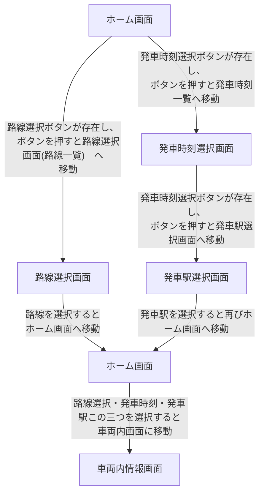

# Quickflow Spec

# 混雑回避アプリ

## 現状の背景や課題

*公共交通機関の混雑によって移動効率が低下し、利用者のストレスが増加している。*

## アプリを導入する目的

*アプリによる乗客の分散*

## 概要

*公共交通機関の利用者が混雑を避け、効率的に移動できるように支援する。各路線の混雑状況や発車時刻を提供し、ユーザーが最適な移動プランを立てるのをサポートする。*

## アプリの機能

- 路線の選択
- 方向（上り、下り）
- 発車駅の選択
- 発車時刻の選択
- 各車両内の混雑状況について

## 画面遷移

## 画面イメージ

### ホーム画面

### 路線選択画面

### 発車時刻選択画面

### 発車駅選択画面

### 車両内情報画面

## 仕様詳細

### ホーム画面

- 操作：タップ
- それぞれの画面に移動できる

### 路線選択画面

- 操作：タップ、スクロール
- 路線の一覧から選択が出来る

### 発車駅選択画面

操作：タップ、スクロール
選択した路線にある駅の一覧から選択が出来る

### 発車時刻選択画面

操作：タップ、スクロール
選択した駅からの発車時刻を一覧から選択が出来る

### 車両内情報画面

路線、時刻、駅を選択する事でその時の混雑状況を車両ごとに確認できる

## コーディング環境

- CPU: HAXM support
    - HAXM: Intel Hardware Accelerated Execution Manager
    - 端的に説明すると、Androidエミュレーションを高速化する機能のこと
- OS: AndroidエミュレーションをサポートしているOS
  - Windows, Linux, macOSなど
- エディタ: Visual Studio Code
  - 拡張機能: Flutter
    - 依存関係:
      - Android Studio: Androidエミュレータ用

## ライブラリ

## フローチャート

